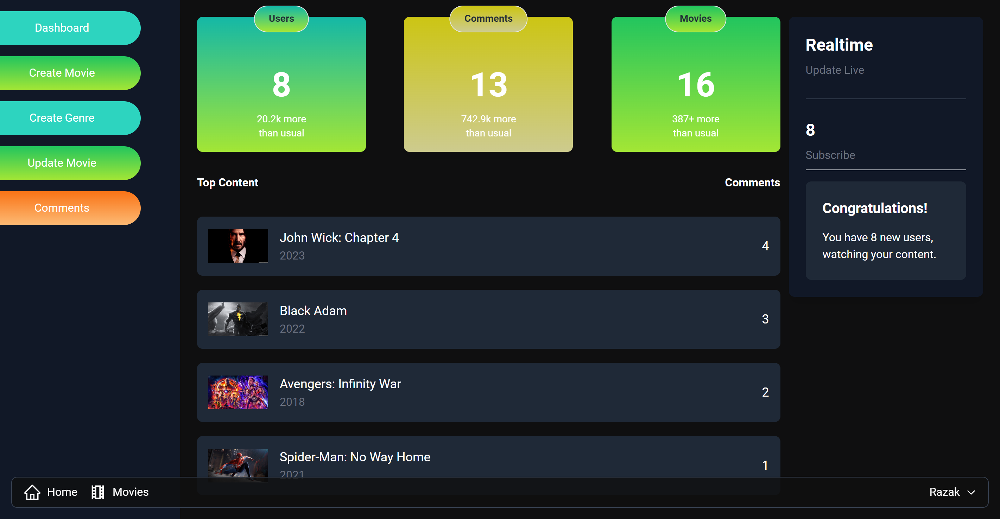

# 🎬 The Movies Vault

**Fullstack fully scalable MERN Movie Application for movie lovers**

## Project Overview

**The Movies Vault** is a comprehensive MERN stack application designed for movie enthusiasts. It offers a scalable and responsive platform where users can explore, review, and manage movies seamlessly.

## Features

### 🌟 Frontend

- **React.js** with **Redux Toolkit** (RTK) for efficient state management.
- **RTK Query** for streamlined API calls.
- **React Router DOM** for smooth navigation.
- **React Slick** with **Slick Carousel** for an enhanced carousel experience.
- **React Toastify** for notifications.
- **React Icons** for visually appealing icons.
- **Tailwind CSS** for modern and responsive styling.

### 🛠 Backend

- Built with **Node.js** and **Express.js**.
- Multiple RESTful APIs for various functionalities.
- Secure registration and login process using **JWT tokens**, sent as **HTTP-Only Cookies**.
- **Admin Dashboard** with features to:
  - Create, update, and delete movies and genres.
  - Delete user reviews/comments.
  - Display real-time subscriber counts.
- Showcases newly added, top-rated, and suggested movies.
- Advanced filtering based on user interests.
- Users can browse movies, read and write reviews/comments.
- User profile management including name, email, and password updates.

### 🗄 Database

- **MongoDB** with **Mongoose** for robust data management.

## Deployment

- Both frontend and backend are deployed on **Render.com** using their free service. Initial load may take a minute due to cold booting.

## Screenshots

**Home Page**

**Movie Details Page**

**Admin Dashboard Page**

**Movies Collection Page**

Enjoy your movie experience with **The Movies Vault**! 🎥🍿

⭐️ If you like this project, please give it a star!

Created with ❤️ by [Razak Attar](https://github.com/razak571)
